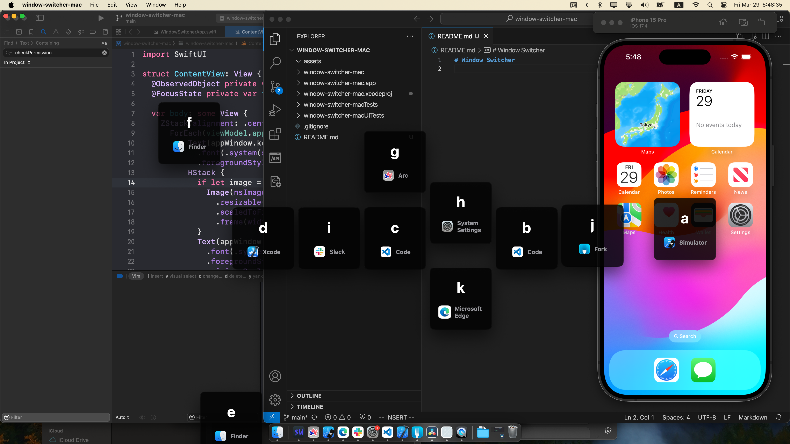

# Window Switcher

It's experiment app for trying Accessibility API.

## Usage

1. Press Command + Escape to show Window Switcher
2. Press an alphabet that you want to focus

## Requirements

- macOS 14.0+
