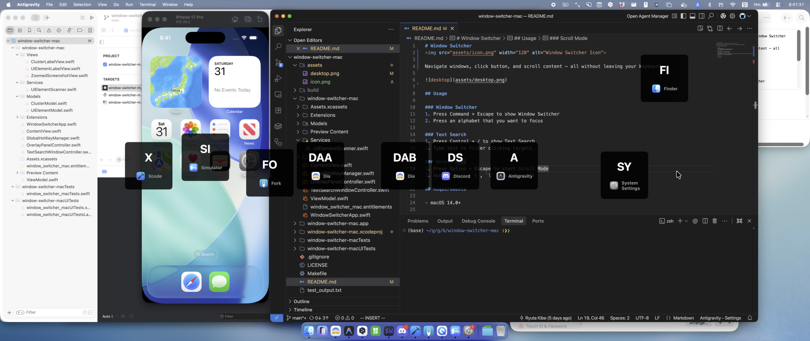

# Window Switcher

Navigate windows, click button, and scroll content — all without leaving your keyboard.

## Usage

### Window Switcher
1. Press Command + Escape to show Window Switcher
2. Press an alphabet that you want to focus

### Text Search
1. Press Control + / to show Text Search
2. Type text to filter clicking targets

### Scroll Mode
1. Press Option + Escape to start Scroll Mode
2. Use `h`, `j`, `k`, `l` keys to scroll

## Requirements

- macOS 14.0+
