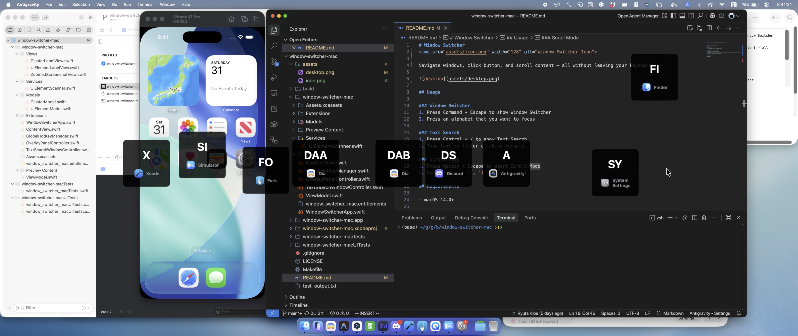

# Window Switcher


Navigate windows, click button, and scroll content — all without leaving your keyboard.



## Installation

Download the latest `.dmg` file from [Releases](https://github.com/beryu/window-switcher-mac/releases) and install it.

## Usage

### Window Switcher
1. Press Command + Escape to show Window Switcher
2. Press an alphabet that you want to focus

### Text Search
1. Press Control + / to show Text Search
2. Type text to filter clicking targets

### Scroll Mode
1. Press Option + Escape to start Scroll Mode
2. Use `h`, `j`, `k`, `l` keys to scroll

## Requirements

- macOS 14.0+

## Release DMG

Export a Developer ID-signed `window-switcher-mac.app` from Xcode into `build/`. `make package` creates a DMG for local inspection. To sign and notarize a DMG for distribution, use a locally installed Developer ID Application identity and a saved `notarytool` keychain profile:

```sh
make release-dmg SIGNING_IDENTITY='Developer ID Application: Your Name (TEAMID)' NOTARY_PROFILE=your-profile
```

Distribute `window-switcher.dmg` only after this command succeeds.
